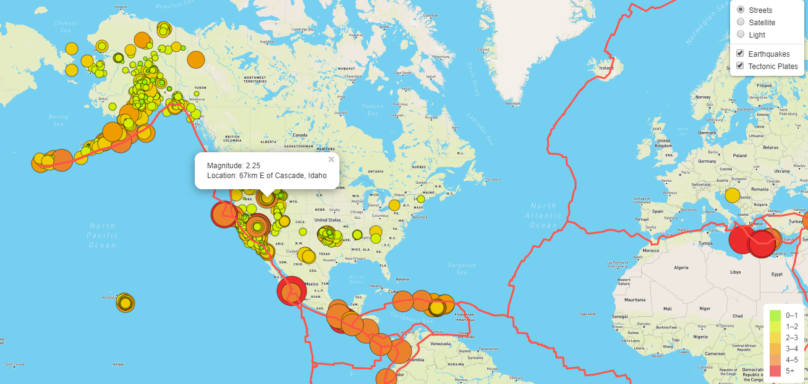

# Mapping_Earthquakes

# Objectives
The goals of this challenge :

* Use d3.json() to get tectonic plate data and add the data   using the L.geoJSON() layer.
* Style the tectonic plate LineString data to stand out on the map.
* Add the tectonic plate data as an overlay with the earthquake data.
* Add a third map style to allow the user to select from three different maps.
# Resources

* Software: Visual Studio Code 1.43.0, HTML, CSS, JavaScript (ES6), Mapbox
* Libraries: D3.js, Leaflet.js
* Data Source: https://earthquake.usgs.gov/earthquakes/feed/v1.0/summary/all_week.geojson , https://raw.githubusercontent.com/fraxen/tectonicplates/master/GeoJSON/PB2002_boundaries.json

# Summary

This map has 3 differnt layers for viewers to swithing their prefered map style. When pointing the the bubble circle, it indicates the level of earthquake magnitude and the color metric is displayed on the right hand conor. Redlines marks the tectionic plates. It is easily identified that there is corrlation between the tectionic plates and the level of earthquake. 
